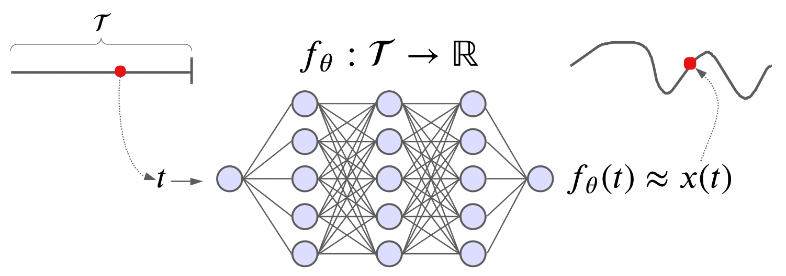
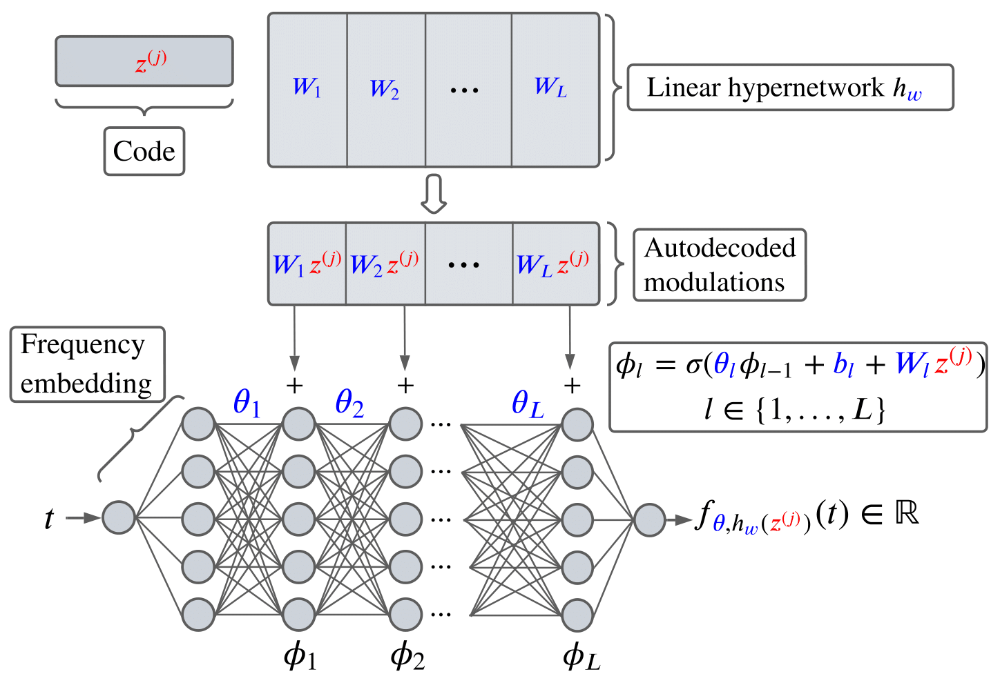
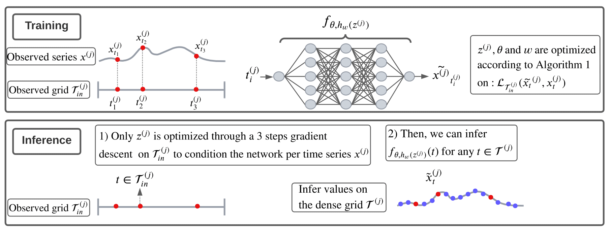
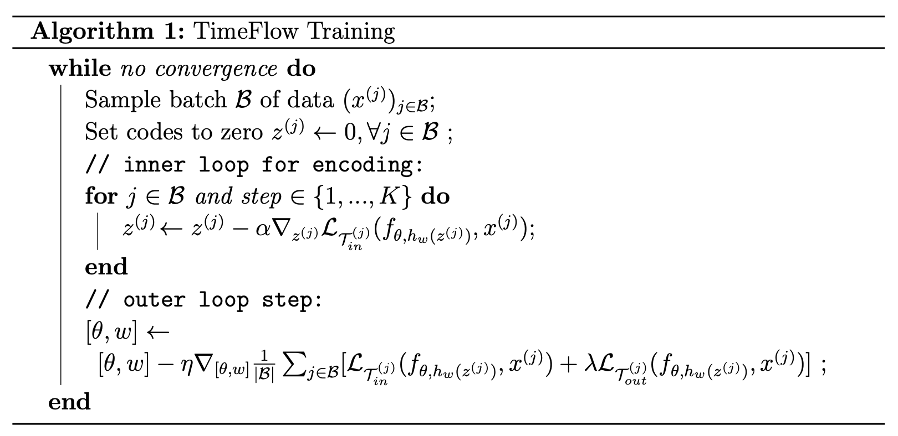
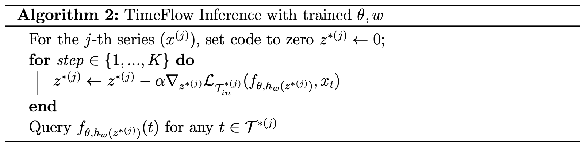
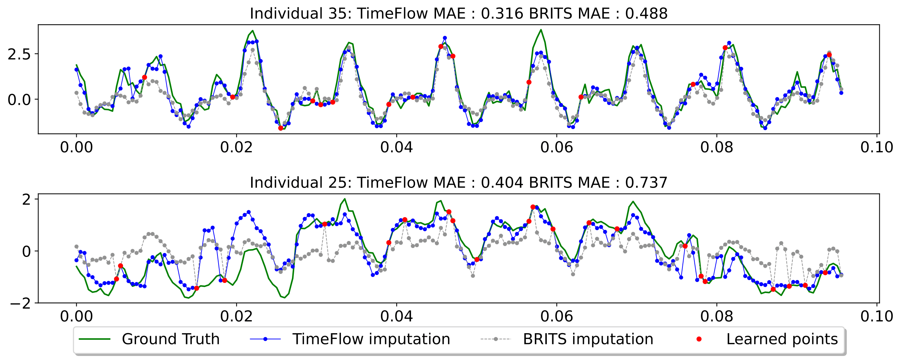
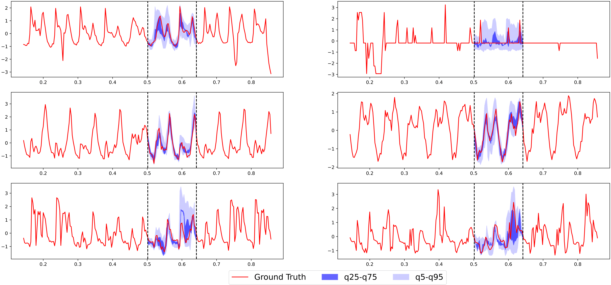

## Time Series Continuous Modeling for Imputation with Implicit Neural Representations (INRs)

This concepts page provides an overview of the theoritical background of **TimeFlow** for the imputation task.

0. [Introduction](#0-introduction)  
1. [What are INRs?](#1-what-are-inrs)  
2. [TimeFlow components](#2-timeflow)  
3. [Some visual experiments](#3-some-visual-results)  
4. [Conclusion](#4-conclusion)  

## 0. Introduction  

Time series data often contain missing values due to sensor failures, irregular sampling, or incomplete measurements. Traditional imputation methods rely on interpolation techniques (e.g., linear interpolation, splines) or deep learning models trained on discretized time steps. However, these approaches struggle with irregularly sampled data and do not fully leverage the continuous nature of time.  

**TimeFlow** addresses these challenges by using **Implicit Neural Representations (INRs)**, a class of models that parameterize continuous functions using neural networks. Unlike classical sequence models that operate on discrete time steps, **TimeFlow models time series as continuous functions**, allowing for seamless imputation and interpolation at any time resolution.  

## 1. What are INRs?  

**Implicit Neural Representations (INRs)** are neural networks that map continuous coordinates (e.g., time) to signal values (e.g., temperature, load consumption etc.). Instead of storing discrete samples, the model learns a **continuous function** that can be queried at arbitrary time points. 

Key properties of INRs:  
- **Continuity**: Time series can be reconstructed at any resolution.  
- **Compactness**: The model stores data information implicitly in its parameters.  
- **Smoothness**: INRs impose regularization, reducing noise and overfitting.  

[INRs](https://arxiv.org/abs/2006.09661) are originaly designed for fitting a single instance. Below is a visual example of an INR designed for fitting a time series.

    

Originally, INRs were designed to fit a single instance (e.g., a single time series), but recently a new family of INRs has emerged called generalized INRs. Generalized INRs allow modeling multiple instances with a single INR by conditioning the neural network on instance-specific parameters. This makes it possible to model multiple objects simultaneously while retaining the ability to interact with each instance separately. 

The mode we implemented, TimeFlow, is a generalized INR model that takes a time coordinate as input and outputs the corresponding signal value applicable to an entire dataset of time series. By training on observed timestamps, the model learns to generalize to missing timestamps for known samples, but also for new samples (not seen during training), effectively **filling in gaps** in the data.

## 2. TimeFlow   

TimeFlow is based on three core components:  
1. **An implicit neural representation network with Fourier feature encoding.**
2. **An auto-decoding mechanism to modulate the main network per sample (conditioning).**
3. **A meta-learning optimization that allows the training of shared parameters (parameters common to all time series) and per-sample parameters.**

### 2.1. Implicit Representation Network (INR) in the context of TimeFlow
Consider a discrete time series $\boldsymbol{x} = (\boldsymbol{x_{t_1}}, \boldsymbol{x_{t_2}},$ $\ldots, \boldsymbol{x_{t_k}})$ can be represented  by an underlying time-continuous function $\textbf{x} \colon t \in \mathbb{R}_+ \to \boldsymbol{x_t} \in \mathbb{R}^d$. We want to approximate  the ground-truth $\textbf{x}$ by employing implicit neural representations (INRs), which are neural networks capable of learning a parameterized continuous function $f_\theta$ from discrete data by minimizing the reconstruction loss between observed data and network's outputs. 

We implement our INR with Fourier features and a feed-forward network (FFN) with ReLU activations, i.e. for a time coordinate $t\in \mathcal{T}$, the output of the INR $f_{\boldsymbol{\theta}}$ is given by $f_{\boldsymbol{\theta}}(t) = \text{FFN}(\boldsymbol{\gamma(t)})$. The Fourier Features $\gamma(\cdot)$ are a frequency embedding of the time coordinates used to capture high-frequencies  ([see this paper](https://arxiv.org/abs/2006.10739)). In our case, we chose $\boldsymbol{\gamma(t)} := (\sin(\pi t), \cos(\pi t), \cdots, \sin(2^{N-1}\pi t), \cos(2^{N-1}\pi t))$, with $N$ the number of fixed frequencies. For an INR with $L$ layers, the output is computed as follows: 
- We get the frequency embedding $\boldsymbol{\phi_0} = \boldsymbol{\gamma(t)}$, 
- We update the hidden states according to $\boldsymbol{\phi_{l}} = \text{ReLU}(\boldsymbol{\theta_{l}} \boldsymbol{\phi_{l-1}} + \boldsymbol{b_{l})}$ for $l = 1, \ldots, L$, 
- We project onto the output space $f_{\boldsymbol{\theta(t)}} = \boldsymbol{\theta_{L+1}} \boldsymbol{\phi_{L}} + \boldsymbol{b_{L+1}}$.

### 2.2. Auto-Decoding that conditionned INRs with modulations  

In TimeFlow, **sample conditioning of the INR is performed through modulations of its parameters**. In order to adapt rapidly the model to new samples, the conditioning should rely only on a small number of the INR parameters. This is achieved by **modifying only the biases of the INR** through the introduction of  an additional bias term $\boldsymbol{\psi_l^{(j)}}$ for each layer $l$, also known as *shift modulation*. To further limit the versatility of the conditioning, we generate the instance modulations $\boldsymbol{\psi^{(j)}}$ from compact codes $\boldsymbol{z^{(j)}}$ through a linear hypernetwork $h$ with parameters $\boldsymbol{w}$, i.e.,  $\boldsymbol{\psi^{(j)}} = h_{\boldsymbol{w}}(\boldsymbol{z^{(j)}})$. Consequently, the approximation of a time series $\boldsymbol{{x}^{(j)}}$, denoted globally as $f_{\boldsymbol{\theta}, h_{\boldsymbol{w}}(\boldsymbol{z^{(j)}})}$, will depend on shared parameters $\theta$ and $w$ that are common among all the INRs involved in modeling the series family and on the code $\boldsymbol{z^{(j)}}$ specific to series $\boldsymbol{x^{(j)}}$. The output of the $l$-th layer of the modulated INR is given by $\boldsymbol{\phi_{l}} = \text{ReLU}(\boldsymbol{\theta_l} \boldsymbol{\phi_{l-1}} + \boldsymbol{b_l} + \boldsymbol{\psi_l^{(j)}})$, where $\boldsymbol{\psi_l^{(j)}} = \boldsymbol{W_l} \boldsymbol{z^{(j)}}$, and $\boldsymbol{w}:=(\boldsymbol{W_l})_{l=1}^{L}$ are the parameters of the hypernetwork $h_{\boldsymbol{w}}$. This design enables gathering information across samples into the common parameters of the INR and hypernetwork, while the codes contain only specific information about their respective time-series samples. 

The whole architecture is illustrated below :

    

### **2.3. Meta-Learning and optimization**  

We condition the INR using the data from the context grid $\mathcal{T}_{in}$, and learn the shared INR and hypernetwork parameters $\boldsymbol{\theta}$ and $\boldsymbol{w}$ using $\mathcal{T}_{in}$ when using context point only, and $\mathcal{T}_{out}$ when using target grid. Below is a visual example where only the context grid is used during training. 

    

We achieve the conditioning on $\mathcal{T}_{in}$ by optimizing the codes $\boldsymbol{z^{(j)}}$ through gradient descent. The joint optimization of the codes and common parameters is challenging. 

In TimeFlow, it is achieved through a meta-learning approach, adapted from [this INR paper](https://arxiv.org/abs/2201.12204) and [this meta-learning paper](https://arxiv.org/abs/1810.03642).  The objective is to learn shared parameters so that the code $\boldsymbol{z^{(j)}}$ can be adapted in just a few gradient steps for a new series $\boldsymbol{x^{(j)}}$. For training, we  perform parameter optimization at two levels: the inner-loop and the outer-loop. The inner-loop adapts the code $\boldsymbol{z^{(j)}}$ to condition the network on the set $\mathcal{T}_{in}^{(j)}$, while the outer-loop updates the common parameters using $\mathcal{T}_{in}^{(j)}$ and also $\mathcal{T}_{out}^{(j)}$ when using target grid. We present our training optimization below.

<!-- #### TimeFlow Training Algorithm -->

    

<!-- 
- Input: Time series dataset, model parameters $\theta, w$, learning rates $\alpha, \eta$, number of inner steps K  
- Output: Trained model parameters

**Initialization:** 

- Set model parameters $\theta$, $w$ 
- Define a loss function $\mathcal{L}$  

**Training Loop:**  

**While** no convergence:  
1. Sample a batch $\mathcal{B}$ of data $\{x^{(j)}\}_{j \in \mathcal{B}}$  
2. Initialize latent codes: $z^{(j)} \gets 0, \forall j \in \mathcal{B}$  
3. **Inner loop (encoding step):**  **For** each $j \in \mathcal{B}$ and step $s \in \{1, ..., K\}$:  $z^{(j)} \gets z^{(j)} - \alpha \nabla_{z^{(j)}} \mathcal{L}_{\mathcal{T}}(f_{\theta, h_{w}(z^{(j)})}, x^{(j)})$
4. **Outer loop (model update):**  $[\theta, w] \gets [\theta, w] - \eta \nabla_{[\theta, w]} \frac{1}{|\mathcal{B}|} \sum_{j \in \mathcal{B}} \mathcal{L}_{\mathcal{T}}(f_{\theta, h_{w}(z^{(j)})}, x^{(j)})$  -->

At each training epoch and for each data batch consisting of time series sampled from the training set, we first update the codes $\boldsymbol{z^{(j)}}$ individually in the inner loop before updating the common parameters in the outer loop using a loss over the entire batch. We introduce a parameter lambda to weight the importance of the loss over the target grid vs. the loss over the context grid for the outer loop. In practice, we set this parameter to 1 if the target grid exists and to 0 otherwise. Additionally, the loss can be a simple MSE loss over the observation grid (more sophisticated losses are also supported). Note that there are two different learning rates: one for the inner loop and one for the outer loop. Using $K=3$ steps for training and testing is sufficient for our experiments thanks to the use of second-order meta-learning.

<!-- We can use an MSE loss over the observations grid $\mathcal{L}_{\mathcal{T}}(x_t, \tilde{x_t}) := \mathbb{E}_{t \sim \mathcal{T}}[(x_t - \tilde{x_t})^2]$. We denote $\alpha$ and $\eta$ the learning rates of the inner-loop and outer-loop. Using $K=3$ steps for training and testing is sufficient for our experiments thanks to the use of second-order meta-learning. -->

### **2.4. TimeFlow inference**

During the inference process, we aim to infer the time series value for each timestamp in the dense grid based on the partial observation grid. We can encounter two scenarios:
- One where we observe the same time window as during training.
- One, where we are dealing with a newly observed time window.

During inference, the shared parameters are kept fixed at their final training values. We optimize the individual parameters $\boldsymbol{z^{* (j)}}$ based on the newly observed grid using the $K$ inner steps of the meta-learning algorithm as described above. We are then able to query the learned conditional INR for any given timestamp. The inference algorithm is given below.

    

<!-- ---
 #### TimeFlow Inference with Trained $\theta, w$

**Input:** Trained model parameters $\theta, w$, time series $\{x^{(j)}\}$, learning rate $\alpha$, number of inner steps $K$  
**Output:** Imputed/forecasted values for $\mathcal{T}^{*(j)}$  

---
**Inference Process:**  
1. **Initialize latent code:**  
   For the $j$-th time series $x^{(j)}$, set:  
   $
   z^{*(j)} \gets 0
   $
2. **Optimize latent code:**  
   **For** step $s \in \{1, ..., K\}$:  
   $
   z^{*(j)} \gets z^{*(j)} - \alpha \nabla_{z^{*(j)}} \mathcal{L}_{\mathcal{T}^{*(j)}_{in}}(f_{\theta, h_{w}(z^{*(j)})}, x_t)
   $
3. **Query the model:**  
   Compute predictions for any $t \in \mathcal{T}^{*(j)}$:  
   $
   f_{\theta, h_{w}(z^{*(j)})}(t)
   $
--- -->

## 3. Some visual results

In this section, we present some visual results that demonstrate the versatility and effectiveness of TimeFlow for imputation. For quantitative results, please refer to the [TimeFlow Paper](https://arxiv.org/pdf/2306.05880).

### 3.1. Pointwise missing values 

Here, we consider the classical imputation setting where $n$ time series are partially observed over a given time window. Using our approach, we can predict for each time series the value at any timestamp $t$ in that time window based on partial observations.

**Setting.** We use the *[Electricity](https://archive.ics.uci.edu/dataset/321/electricityloaddiagrams20112014)* dataset and train TimeFlow on 10% of the observations spanning a week with hourly time steps. Note that the observed time grids may be irregularly spaced and may differ between time series. Our objective is to correctly infer the remaining 90% of the unobserved values.

**Results.** In the figure below, we see an example where TimeFlow shows significant imputation capabilities. In a simple case (sample 35), it imputes various frequencies and amplitudes well, although it underestimates the amplitude of some peaks. In a more challenging scenario (sample 25), where the series has additional trend changes and frequency variations within the data, TimeFlow correctly imputes most timestamps, outperforming the [BRITS model](https://arxiv.org/abs/1805.10572), which is a strong deep learning baseline for imputation.

    

### 3.2. Block missing values and uncertainity quantification

TimeFlow can also be trained using the pinball loss function. This quantile loss, coupled with TimeFlow, allows for continuous modeling of uncertainty over time, providing a more robust and comprehensive understanding of the temporal dynamics and variability within the time series. Here is a qualitative illustration of uncertainty estimation for the block imputation task.

**Setting.** We use the *Electricity* dataset and train TimeFlow with pinball losses to fit time series spanning two weeks with hourly time steps (T=336). During inference, for time series not seen during training, we fill in a missing block of two days (48 points). We estimate the 5%, 25%, 75%, and 95% quantiles. The figure below illustrates the uncertainty estimation results for six samples.

**Results.** As shown below, TimeFlow effectively produces fairly narrow uncertainty bands, most of which encompass the ground truth. For more challenging imputation cases, the uncertainty bands tend to be wider, indicating the increased difficulty of the task. This highlights TimeFlow's capability to adaptively quantify uncertainty based on the complexity of the block imputation scenario.

    

## 4. Conclusion

**Summary**. TimeFlow is a unified framework for continuous time series modeling, combining conditional INR with meta-learning. Our approach outperforms existing continuous methods and achieves results that are on par with or superior to state-of-the-art discrete models. A key strength of TimeFlow lies in its inherent continuity and the ability to dynamically adjust INR parameters. This flexibility enables it to handle a wide range of challenges, including forecasting with missing data, adapting to irregular timesteps, and generalizing to unseen time series and new time windows.

**Note to the reader**. For a deeper dive into our methodology and results, we invite you to explore the full [TimeFlow Paper](https://arxiv.org/pdf/2306.05880).